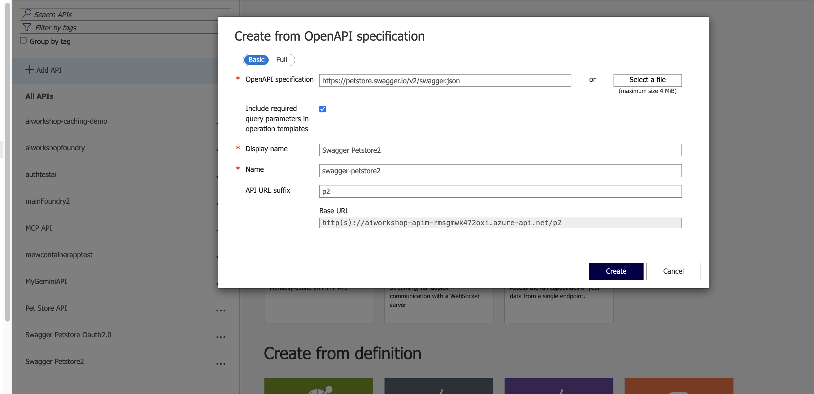
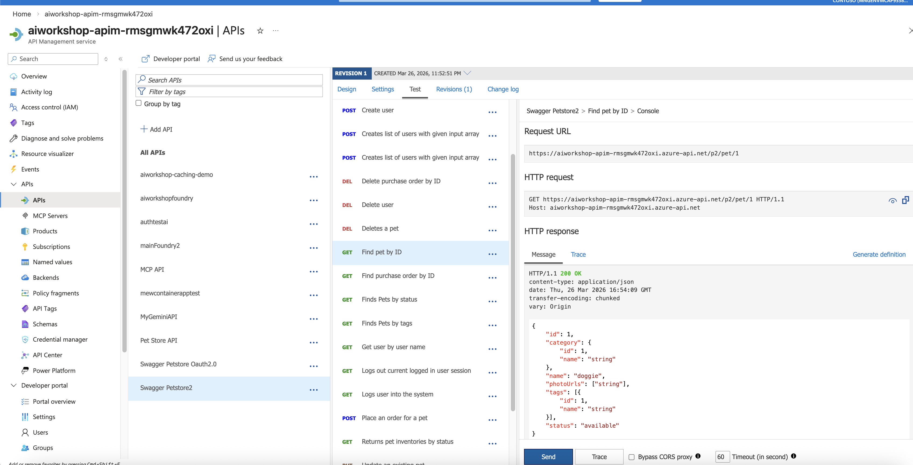
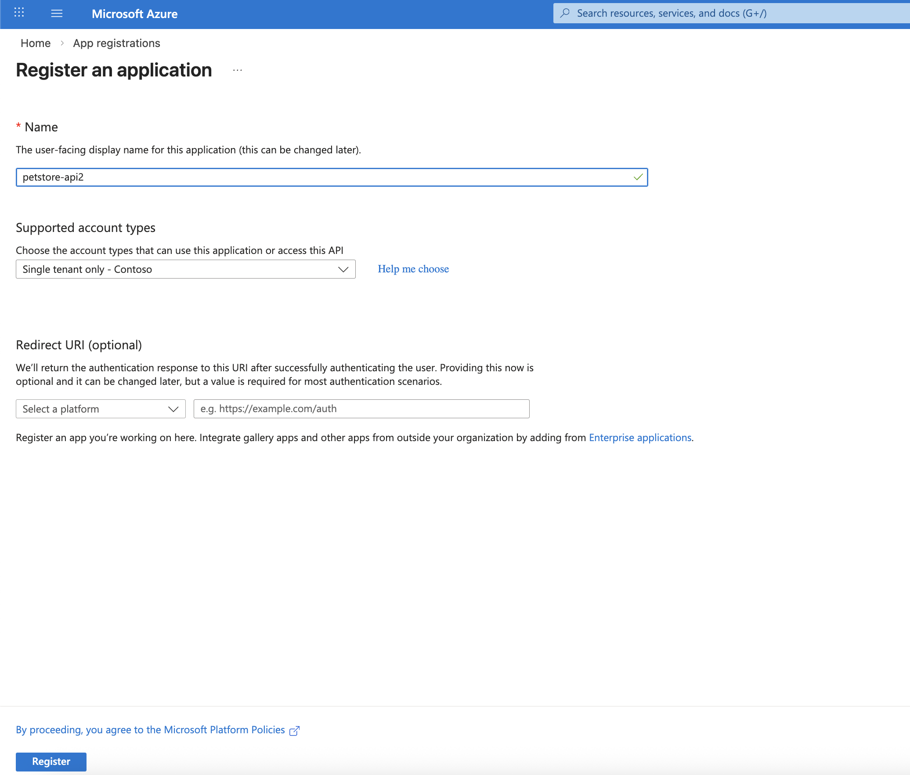
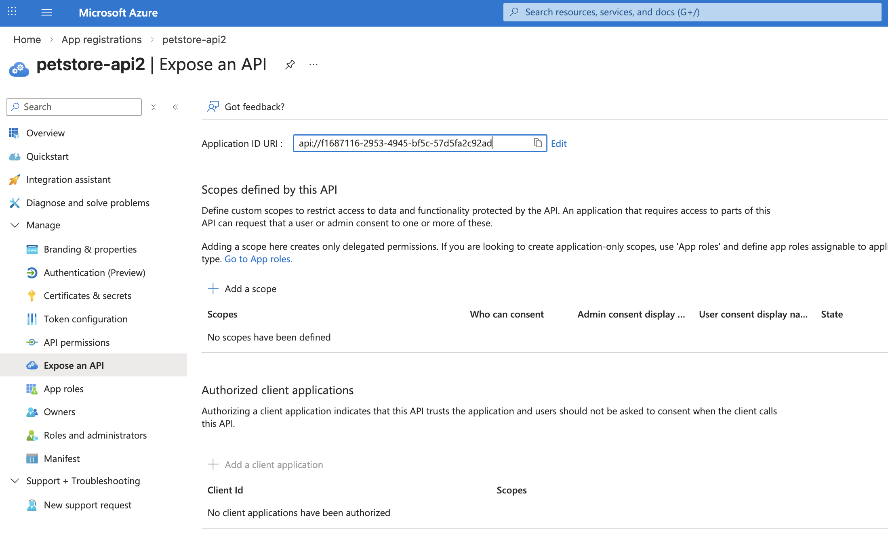
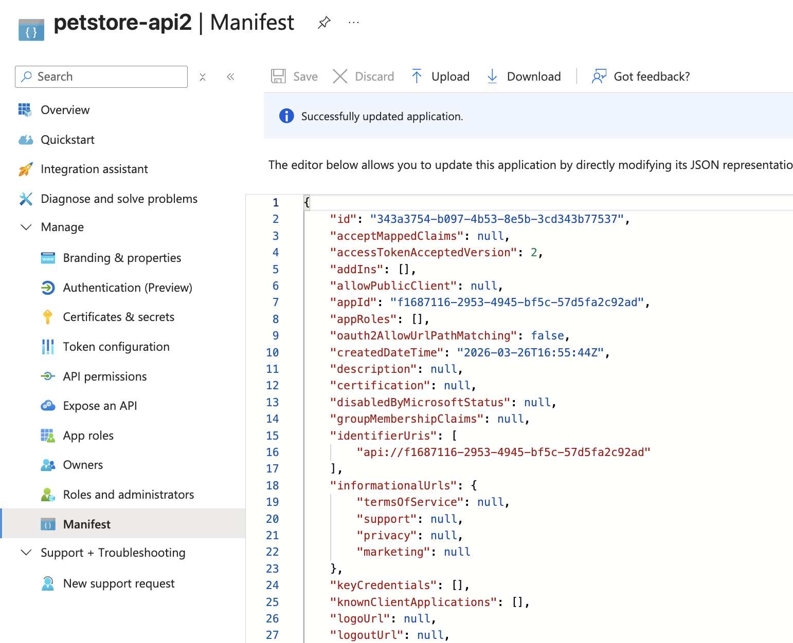

# APIM JWT Validation

## Prerequisites

- Azure API Management instance
- Azure App Registration (Entra ID)
- [`jq`](https://jqlang.org/) installed locally

---

## Steps

### 1. Add an API

Add an example api with openapi using: https://petstore.swagger.io/v2/swagger.json



---

### 2. Test the API (unauthenticated)

Test the "Find Pet by ID" and put in id as 1.



---

### 3. Create an App Registration

Create an app registration:



Copy the client_id, tenant_id and create a secret value and populate `.env`

---

### 4. Expose the API

Please expose the API:



---

### 5. Update the Manifest

Please change "accessTokenAcceptedVersion" to 2



---

### 6. Verify the Token

Recheck with

```bash
bash token_generation.sh | jq -r '.access_token' | cut -d. -f2 | awk '{ n=length($0)%4; if(n==2) print $0"=="; else if(n==3) print $0"="; else print $0 }' | tr '_-' '/+' | base64 -D | jq '{iss,aud,ver}'
```

---

### 7. Apply the APIM Policy

Now go back to APIM and replace the policies with

```xml
<policies>
    <inbound>
        <base />
        <cors allow-credentials="false">
            <allowed-origins>
                <origin>*</origin>
            </allowed-origins>
            <allowed-methods preflight-result-max-age="300">
                <method>*</method>
            </allowed-methods>
            <allowed-headers>
                <header>*</header>
            </allowed-headers>
            <expose-headers>
                <header>*</header>
            </expose-headers>
        </cors>
        <validate-jwt header-name="Authorization" failed-validation-httpcode="401">
            <openid-config url="https://login.microsoftonline.com/b10aac9b-2c9e-4cdf-a55e-c5042367b05e/v2.0/.well-known/openid-configuration" />
            <audiences>
                <audience>client-id</audience>
            </audiences>
        </validate-jwt>
    </inbound>
    <backend>
        <base />
    </backend>
    <outbound>
        <base />
    </outbound>
    <on-error>
        <base />
    </on-error>
</policies>
```

---

## Further Reading

- See more advanced tutorial at: https://www.youtube.com/watch?v=0gSHAlvjw38
- Try these labs: https://github.com/Azure/apim-lab
# apim-jwt-101
